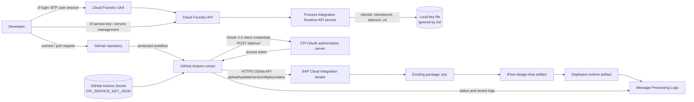
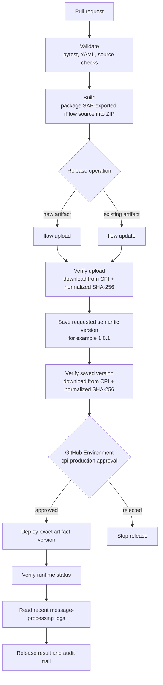

# SAP CPI GitHub SDLC Architecture

## Executive view

This project uses two separate SAP BTP access paths:

- Cloud Foundry CLI authenticates a human developer to BTP for tenant/service
  administration and service-key retrieval.
- GitHub Actions authenticates to the Cloud Integration OData API with the
  OAuth client credentials stored in the GitHub Actions secret
  `CPI_SERVICE_KEY_JSON`.

Cloud Foundry authentication is not used as the runtime deployment credential.
The GitHub runner calls the CPI API directly with the API-client service
instance credentials.



## SDLC release flow



The pipeline is implemented by the reusable workflow
`.github/workflows/sap-cpi-sdlc.yml`. The flow-specific workflows only select
the manifest, source directory, artifact ID, operation, and release version.

## Authentication responsibilities

| Area | Credential | Used by | Purpose |
| --- | --- | --- | --- |
| BTP/Cloud Foundry | Human `cf login` session | Developer | Target org/space, inspect services, create or retrieve service keys |
| CPI API | API-client service-key OAuth client credentials | Local CLI and GitHub runner | Read, upload, update, version, deploy, and monitor CPI content |
| GitHub repository | GitHub user/PAT or browser session | Developer/Git client | Commit, push, pull request, and workflow administration |
| GitHub deployment gate | Protected Environment reviewers | Approvers | Authorize the deploy job after artifact/version verification |

The service key must come from a Process Integration Runtime `api` service
instance with the required Cloud Integration API roles. The `integration-flow`
plan is for invoking deployed flow endpoints and is not sufficient for this
design-time content lifecycle.

## Exact artifact lifecycle in package `poc`

For a new artifact:

```text
Git source → ZIP → POST IntegrationDesigntimeArtifacts
→ download/compare active draft → SaveAsVersion(1.0.1)
→ download/compare 1.0.1 → approval
→ DeployIntegrationDesigntimeArtifact(1.0.1)
→ IntegrationRuntimeArtifacts/status → MessageProcessingLogs
```

For an existing artifact, the first API operation is a PUT update of the
active draft rather than a POST upload. CPI editor locks can reject that update;
the lock must be released before the release is retried.

## Security boundaries

- `CPI-API-KEY.json`, `.env`, and other credential files are ignored and must
  never be committed.
- GitHub writes the repository secret to a temporary runner file, uses it for
  OAuth, and removes it in cleanup steps.
- Secrets and access tokens must not be printed in workflow logs.
- The deploy job is isolated behind the `cpi-production` Environment approval.
- The runner does not need Cloud Foundry credentials for iFlow deployment.

## Operational limitations

- The iFlow graphical model remains SAP-proprietary exported XML. GitHub can
  version and transport it but is not a local graphical designer.
- Upload, update, version, deploy, and runtime status are separate CPI API
  operations; a successful upload does not mean deployment succeeded.
- Deployment is asynchronous and can fail after the design-time artifact is
  visible in the CPI UI.
- Credentials, certificates, keystores, security material, externalized
  parameters, and tenant-specific configuration require separate management.
- Rollback is performed by deploying a previously verified version; the
  workflow does not delete or undeploy artifacts automatically.

## Official references

- [SAP GitHub integration](https://help.sap.com/docs/integration-suite/isuite-integrations-and-apis/integrating-with-github)
- [SAP Cloud Integration API examples](https://help.sap.com/docs/cloud-integration/sap-cloud-integration/integration-flow-example-requests)
- [SAP Cloud Integration content](https://help.sap.com/docs/cloud-integration/sap-cloud-integration/integration-content)
- [SAP CI&D Integration Suite artifact job](https://help.sap.com/docs/continuous-integration-and-delivery/sap-continuous-integration-and-delivery/configure-sap-integration-suite-artifacts-job-in-job-editor)
